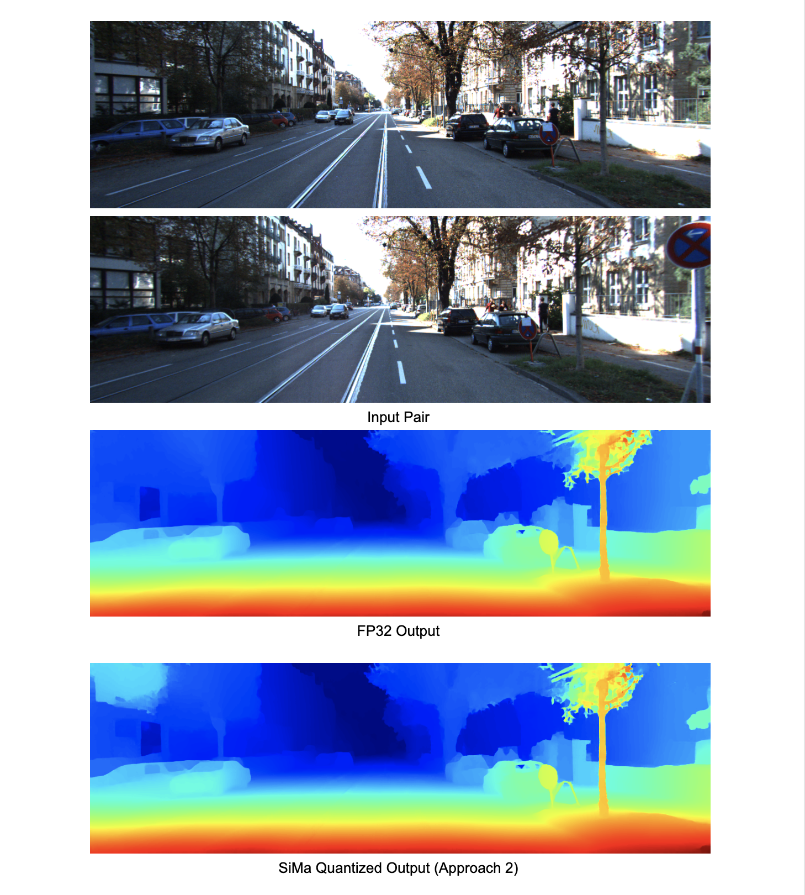

# RAFT-Stereo: Multilevel Recurrent Field Transforms for Stereo Matching  


Paper: https://arxiv.org/pdf/2109.07547

Code: https://github.com/princeton-vl/RAFT-Stereo


## Implementation Details:

The entire model is divided into 3 parts:
    
```
1. Feature and Context Encoder
2. Correlation Block
3. Iterative refinement block
```

Out of the 3 parts above, only the correlation block **cannot** be mapped to the MLA due to unsupported grid sampling operation. Both, ```1``` and ```3``` can be mapped to the MLA

## Usage

- Clone the repository
- Create a conda environment and install requirements from 'requirements.txt'
- To run the FP32 model, run the following command from the terminal
    ```
    python3 demo.py --restore_ckpt "checkpoints/raftstereo-middlebury.pth" --left_imgs "input_images/left.png" --right_imgs "input_images/right.png" --export
    ```
    After running this command, you will have an general ONNX and a simplified ONNX file in the ```checkpoints``` folder
- There are currently 2 approaches in place to run this pipeline in ***SiMa ModelSDK***:

    *Approach 1*: Run the feature and context encoder as well as the iterative refinement block on the MLA and run correlation block outside the model

    ```
    python3 LQCE.py --fee_path "checkpoints/rs_extractor_encoder_simplified.onnx" --refiner_path "checkpoints/rs_refiner_simplified.onnx" --left_imgs "input_images/left.png" --right_imgs "input_images/right.png" --fast_mode --compile
    ```

    ***LQCE stands for Load Quantize Compile Execute***

    *Approach 2*: Run only the feature and context encoder on the MLA, the rest, outside the model (gives much better results)

    ```
    python3 LQCE_torch.py --fee_path "checkpoints/rs_extractor_encoder_simplified.onnx" --refiner_path "checkpoints/rs_refiner_simplified.onnx" --left_imgs "input_images/left.png" --right_imgs "input_images/right.png" --fast_mode --compile
    ```

- Logs will be saved in the ```logs``` directory
- Output disparity maps are saved in ```output_disparity``` folder
- Compiled models are in ```outputs/sima``` folder
  


## Checklist

- [x] FP32 Inference
- [x] SiMa Quantized Approach 1 Inference
- [x] SiMa Quantized Approach 2 Inference
- [ ] SiMa QAT
- [ ] Metric Scores
- [ ] Documentation